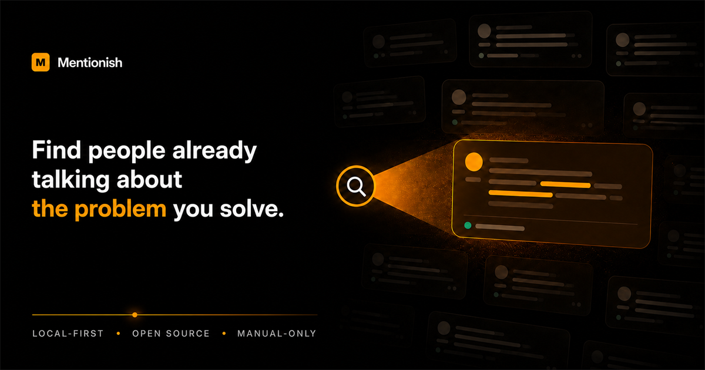
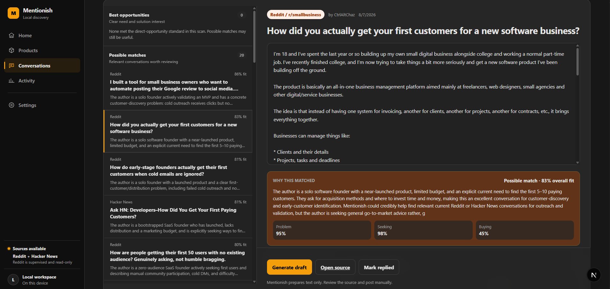
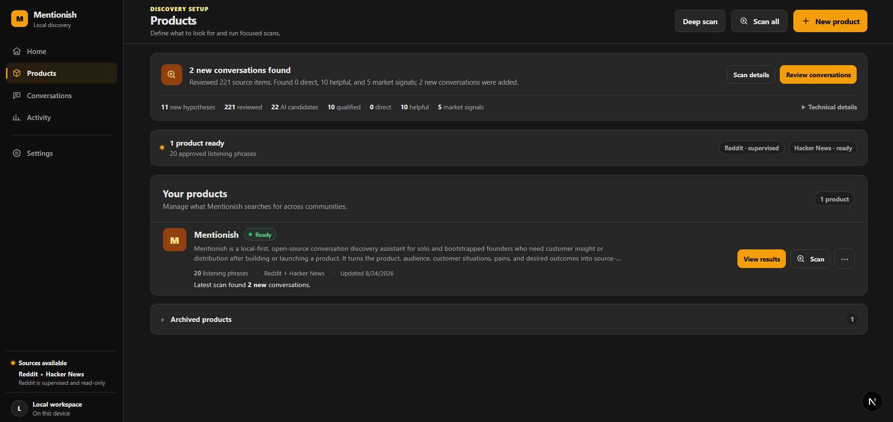

<p align="center">
  
</p>

<h1 align="center">Mentionish</h1>

<p align="center"><strong>Not social listening. Problem listening.</strong></p>

<p align="center">
  Your next customer may already be describing their problem in public.<br />
  Mentionish helps you find that conversation while it is still worth joining.
</p>

<p align="center">
  <a href="#start-in-under-a-minute">Quick start</a> ·
  <a href="#how-it-works">How it works</a> ·
  <a href="#why-local-first">Why local-first</a> ·
  <a href="#contributing">Contribute</a>
</p>

<p align="center">
  
  
  
  
</p>

---

Most founders do not need more impressions. They need the **right conversation**.

Someone is frustrated with their current workflow. Someone is asking for a recommendation. Someone has tried three tools and none of them worked. Those conversations are scattered across communities—and ordinary keyword alerts bury them in noise.

Mentionish turns your product into search hypotheses, scans the communities you enable, ranks relevant posts and comments, and explains **why each conversation may matter**. It runs on your machine, uses your AI provider, keeps replies manual, and never posts as you.

<p align="center">
  
</p>

## The difference

A keyword alert asks: **“Did this post contain my phrase?”**

Mentionish asks:

- Who is speaking, and do they resemble the customer you can help?
- What problem are they experiencing right now?
- Are they seeking advice, comparing tools, or merely discussing a topic?
- Is there a natural, useful reason to reply?

The result is not an automated outreach machine. It is a focused workspace where **Mentionish finds and explains; you decide and reply.**

## How it works

| Step                          | What happens                                                                                                                         |
| ----------------------------- | ------------------------------------------------------------------------------------------------------------------------------------ |
| **1. Describe your product**  | Add the problem, ideal customer, and reply style. AI can refine rough input without replacing your judgment.                         |
| **2. Build discovery intent** | Mentionish proposes pain phrases, questions, comparisons, situations, and broader search hypotheses. You approve what it should use. |
| **3. Run a supervised scan**  | Each explicit scan searches enabled sources and evaluates lexical plus conceptual candidates. There is no hidden scheduler.          |
| **4. Review and respond**     | See ranked opportunities, match reasoning, and an optional editable draft. Open the original source and post manually.               |

<p align="center">
  
</p>

## What you get

- Product-aware discovery instead of a fixed list of literal keyword searches
- Ranked **best opportunities**, helpful conversations, and broader market signals
- Clear explanations and fit scores for every evaluated result
- Feedback controls that improve later ranking without silently rewriting your phrases
- Separate AI models for classification and drafting
- OpenAI, Anthropic, OpenRouter, and OpenAI-compatible provider support
- Local SQLite storage, encrypted local secrets, and portable backup/restore
- No login, hosted database, Docker, Redis, worker, billing, or background scheduler
- No write APIs and no automatic likes, follows, messages, comments, or posts

## Sources

| Source          | Status       | How it works                                                                    |
| --------------- | ------------ | ------------------------------------------------------------------------------- |
| **Hacker News** | Ready        | Public search; no account or API key required                                   |
| **Reddit**      | Experimental | Supervised read/search through a user-selected local OpenCLI browser profile    |
| **X / Twitter** | Planned      | Intentionally deferred until the core Reddit + Hacker News experience is proven |

> [!WARNING]
> Reddit discovery relies on an unofficial, user-supervised local integration. It can break and may carry platform-enforcement risk. Mentionish fails closed, never receives your password, and never posts through an API. Read the [Agent Reach integration contract](docs/agent-reach-integration.md) before enabling it.

## Start in under a minute

You need [Node.js 22+](https://nodejs.org/) and npm 11+.

```bash
git clone https://github.com/sayan365/mentionish.git
cd mentionish
npm install
npm start
```

Mentionish initializes its database, runs local migrations, starts the loopback-only API and dashboard, and opens the app in your browser.

On first run:

1. Open **Settings → AI models** and add your provider key.
2. Create a product and review the AI-assisted discovery phrases.
3. Keep Hacker News enabled, or configure a supervised Reddit profile.
4. Click **Scan**, review the reasoning, and open promising conversations at their source.

That is the whole operating model. There is no account to create and no cloud backend to configure.

## Why local-first

Your products, discovery history, feedback, drafts, and credentials should not become somebody else’s growth database.

- The API binds to loopback by default.
- The embedded database stays on your device.
- Secrets are encrypted in a local vault and are never returned to the browser after saving.
- Scans happen only when you start them.
- Drafts remain text until you copy and manually submit them.

See [Local data lifecycle](docs/local-data-lifecycle.md) for backup, restore, moving computers, reset, and uninstall instructions.

## Deliberately not included

Mentionish does **not** include automated posting, mass outreach, engagement automation, hidden background scraping, hosted accounts, billing, or team surveillance. These are product boundaries—not missing features.

## Development

```bash
npm run dev                 # API, dashboard, and shared packages
npm run check               # complete project checks
npm run smoke:clean-install # isolated first-run smoke test
npm run local:doctor        # inspect local connector availability
npm run audit:licenses      # review dependency licenses
```

If port 3000 is occupied in PowerShell:

```powershell
$env:DASHBOARD_PORT=3100; npm start
```

The architecture, product contracts, and current release plan live in [docs/README.md](docs/README.md) and [docs/roadmap.md](docs/roadmap.md).

## Contributing

If you believe founders deserve a calmer, more honest way to discover customers, help build it.

Read [CONTRIBUTING.md](CONTRIBUTING.md) for the local workflow, quality gates, privacy rules, and the non-negotiable manual-posting boundary. Please report security issues privately according to [SECURITY.md](SECURITY.md)—never attach credentials, cookies, databases, backups, or identifiable scan data.

## License

Mentionish is free and open source under the [MIT License](LICENSE).

---

<p align="center"><strong>Find the conversation. Understand the need. Show up like a human.</strong></p>
